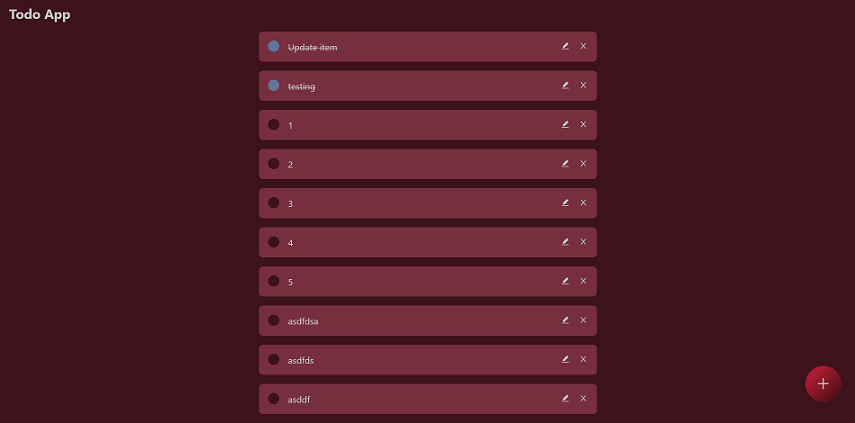
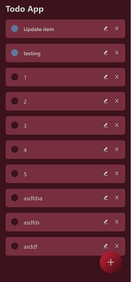

# Technical Examination - Todo App (MERN)

## Table of contents

- [Overview](#overview)
  - [The challenge](#the-challenge)
  - [Built with](#built-with)
  - [Links](#links)
  - [Screenshot](#screenshot)
- [Resources](#resources)
- [Author](#author)

## Overview

### The challenge

Create a simple todo application that allows users to:

1. Create a todo item,
2. Mark a todo item as completed,
3. Remove a todo item

   _\*Must use ReactJS for frontend_

   _\*Must have a backend built on NodeJS_

   _\*Must host your code on GitHub_

### Built with

- **Frontend** - React
- **Backend** - MongoDB, Express, NodeJs

### Links

- GitHub Repo: [Repo](https://github.com/fidellim/EventsHub-Technical-Examination)
- Live Site URL: [Live Site](https://eventshub-fullstack-exam-fidellim.netlify.app/)

### Screenshot

## Resources

- [React Icons](https://react-icons.github.io/react-icons) - using react-icons dependency.
- [Submit using Enter Key](https://reactgo.com/react-trigger-button-click/#:~:text=Using%20the%20onKeypress%20event,the%20Enter%20key%20is%2013.) - submit using enter key as an alternative to a submit button.
- [Put Request using Fetch](https://jasonwatmore.com/post/2020/11/02/react-fetch-http-put-request-examples) - send an HTTP PUT request using fetch.
- [Animate line-through using CSS](https://stackoverflow.com/questions/36267507/is-it-possible-to-animate-a-css-line-through-text-decoration) - add an animation of a text's line-through.
- [Export in CommonJS Module Syntax NodeJs](https://stackoverflow.com/questions/38296667/getting-unexpected-token-export) - export using modules.
- [Router.use() error](https://stackoverflow.com/questions/27465850/typeerror-router-use-requires-middleware-function-but-got-a-object) - router.use() requires middleware function but got an Object solution.
- [Deploy subdirectory to Heroku](https://janessagarrow.com/blog/how-to-deploy-a-subdirectory-to-heroku/) - how to deploy the backend of a project using Heroku with a subdirectory of frontend and backend.
- [Nodemon not working with Heroku](https://stackoverflow.com/questions/56047981/node-js-heroku-deployment-on-mac-sh-1-nodemon-not-found-npm-err-nodemon) - if nodemon is a dev dependency, it won't work when deploying to Heroku. As Heroku only installs dependencies for production.
- [API with empty path deploying to Heroku](https://stackoverflow.com/questions/62015887/heroku-application-crashed-at-error-code-h10-desc-app-crashed-method-get-path) - do not deploy a project with an empty path "/". It will cause an error.

## Author

- Website - [Fidel Lim Portfolio](https://fidellim-portfolio.netlify.app/)
- Github - [fidellim](https://github.com/fidellim)
